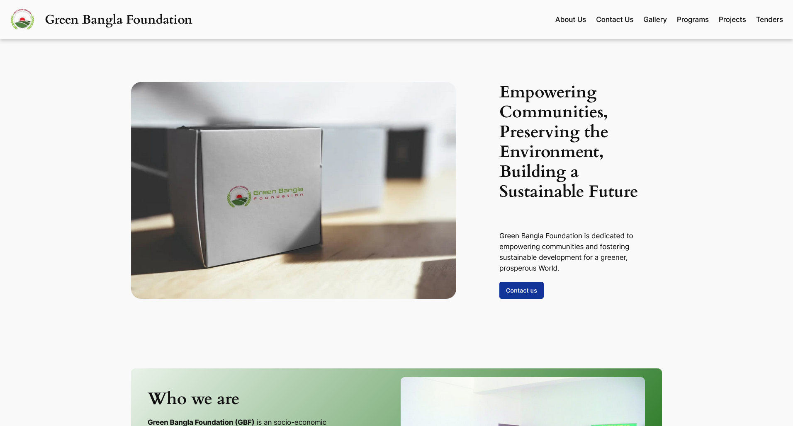
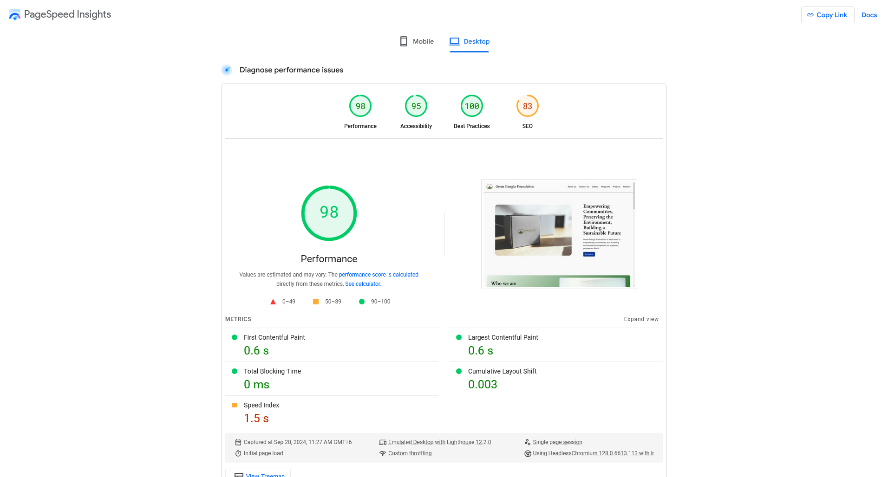
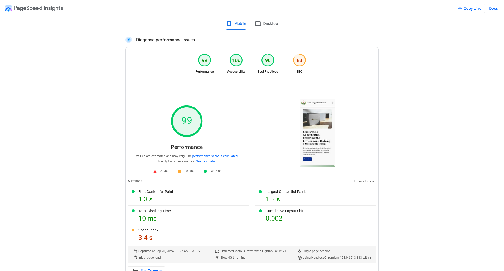
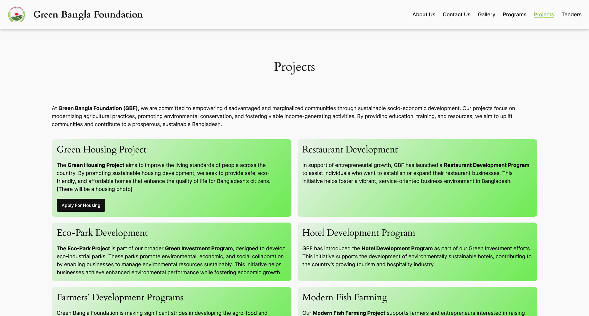

# Optimizing Website Performance: A Case Study on Speed and Responsiveness

As a **Web Developer**, I had the opportunity to develop a custom WordPress website for the **Green Bangla Foundation**, focusing on achieving high-performance standards and a responsive user experience. This post highlights the key steps I took to optimize the site for speed and performance, with a focus on how I utilized **Gutenberg Full Site Editing (FSE)** and minimal plugins to deliver excellent results.

## Project Overview

The project involved building a responsive website on a tight budget and timeline, as the previous site had been hacked. I used **WordPress** as the platform, incorporating **Gutenberg FSE** for ease of content management and customizing the site using **CSS**. Notably, the site achieved a perfect score of 100 in **Site Speed**, **Accessibility**, and **Best Practices**, and scored 83 in **SEO** on **Google Lighthouse**.

## Achieving Top Performance Scores

One of the main goals for the Green Bangla Foundation website was to achieve top performance in Google’s **Lighthouse** report. The website received a perfect score of 100 for **site speed**, which is crucial for user experience and search engine ranking. Page speed is an important factor in SEO, as search engines like Google prioritize fast-loading websites.

### Page Speed Insights for Desktop

To measure the site's performance, I used **Google PageSpeed Insights** for both desktop and mobile versions. Here's the PageSpeed Insight score for the **desktop version** of the website:

As you can see, the desktop version of the site achieved a **perfect score of 100** for speed, indicating that the website loads efficiently on desktop devices. This is essential for retaining visitors and providing a smooth user experience.

### Mobile Speed: A Critical Factor

While desktop speed is important, mobile speed is equally—if not more—critical. With a growing number of users browsing websites from mobile devices, ensuring that your site is optimized for mobile performance is a key part of SEO and user satisfaction.

Mobile optimization is not just about loading speed but also about providing a seamless, user-friendly experience on smaller screens. With mobile traffic on the rise, a slow-loading mobile site can lead to high bounce rates and lower engagement.

As shown in the **mobile version** of the PageSpeed Insights, the site also achieved a great score, demonstrating the optimization for mobile users. By focusing on mobile-first design and performance, the website ensures that it delivers a fast, responsive experience for all visitors, regardless of device.

## Why Speed and Responsiveness Matter

Fast-loading websites tend to rank better in search engine results, resulting in increased traffic and better visibility. Furthermore, page speed directly impacts user retention—if your website loads slowly, visitors are more likely to leave before even seeing your content.

Mobile responsiveness, in particular, is important because search engines like Google use mobile-first indexing, meaning they prioritize the mobile version of your site for ranking purposes. Optimizing your website for mobile devices not only improves SEO but also enhances user experience, leading to higher conversion rates.

## The Final Result: Green Bangla Foundation Website

The website I developed for the Green Bangla Foundation successfully combines high performance, mobile responsiveness, and user-friendly content management through WordPress and **Gutenberg FSE**. This project highlights my ability to deliver exceptional results on tight budgets and timelines, providing a website that not only meets the needs of the client but also exceeds expectations in terms of performance and usability.

## Conclusion

Optimizing website performance for both speed and mobile responsiveness is crucial for achieving success in today’s digital landscape. Whether you’re building a new website or improving an existing one, paying attention to these factors can make a significant difference in your site’s SEO, user engagement, and overall success.

By focusing on key performance indicators like **site speed**, **mobile optimization**, and **SEO**, I was able to deliver a high-performing website for the Green Bangla Foundation, even under tight constraints.

---

### Skills & Deliverables:

- **WordPress Website Development**: Creating responsive, custom WordPress sites that are fast and easy to manage.
- **Gutenberg FSE**: Leveraging Full Site Editing for simplified content management and site design.
- **Page Speed Optimization**: Implementing strategies to boost website loading times for both desktop and mobile.
