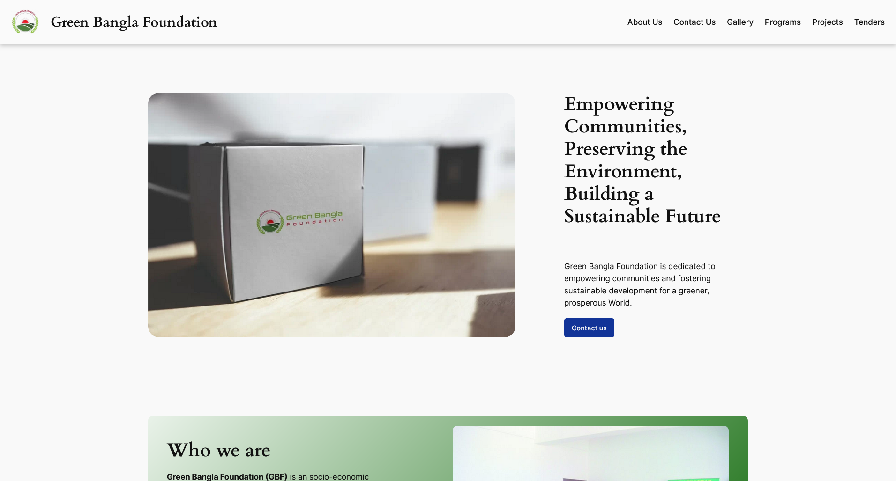
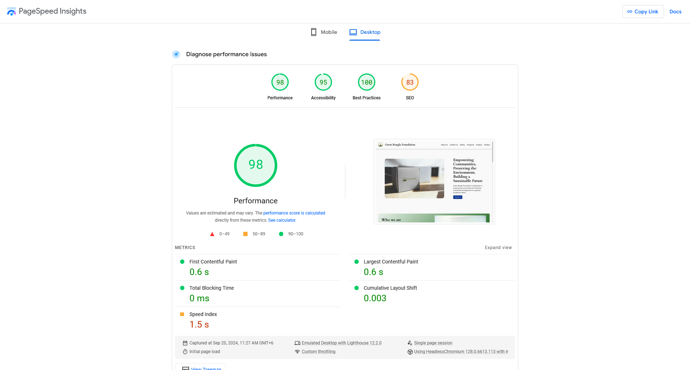
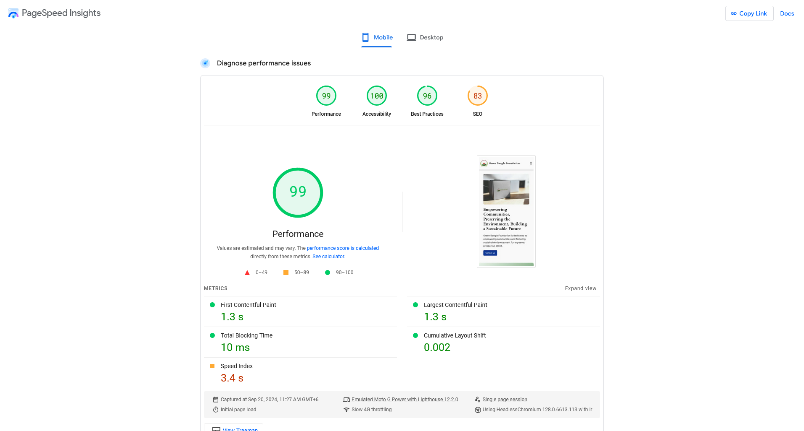
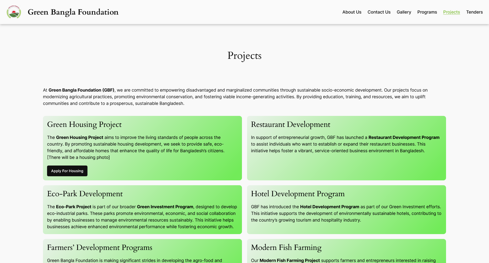

## A speed-first WordPress build

The Green Bangla Foundation needed a new site fast, on a tight budget, after their old one was hacked. I built it on WordPress using Gutenberg Full Site Editing (FSE) and almost no plugins, then tuned it by hand. The result scored 100 for speed, accessibility, and best practices on Google Lighthouse, and 83 for SEO.

> **Key Takeaways**
>
> - A near plugin-free WordPress build with Gutenberg FSE hit a perfect 100 Lighthouse score for speed, accessibility, and best practices.
> - Most of the speed came from cutting plugins and optimizing images, not from a caching plugin bolted on at the end.
> - Mobile-first matters: Google indexes the mobile version of a site first, so that's where I started.

## Why so few plugins?

Every plugin you add is more code the browser has to download, parse, and run. The previous site had been hacked, and a bloated plugin stack is exactly the kind of attack surface that invites trouble. So I kept the dependency list short and leaned on Gutenberg FSE for layout and CSS for the rest. Fewer moving parts meant a lighter page, a smaller attack surface, and a site the client could actually manage themselves.

## How I hit a perfect speed score

Page speed is one of the few ranking factors Google has confirmed outright, so it was the first thing I went after. The desktop build came back at a perfect 100.

### Desktop PageSpeed Insights

I measured both versions with Google PageSpeed Insights. Here's the desktop result:

A score of 100 means the page loads with almost no wasted work. No render-blocking scripts, properly sized images, and clean markup. For a visitor, it just feels instant.

### Mobile speed is the harder one

Desktop is the easy win. Mobile is where most sites fall down, and it's where most of the traffic actually is. A slow mobile page bleeds visitors before they ever see the content.

The mobile build held up well too. I designed mobile-first and kept the same lean approach, so the experience stays quick whether someone arrives on a phone or a laptop.

## Why speed and responsiveness matter

Fast sites rank better and keep more of the people who land on them. That's the short version. The longer version is that Google uses mobile-first indexing, which means it judges your site by its mobile version, not its desktop one. Get mobile wrong and you've hobbled your rankings before you've written a word of content.

## The final result

The Green Bangla Foundation site pairs high performance with a content setup the client can run on their own through WordPress and Gutenberg FSE. It shipped on a tight budget and a tight timeline, and it did so without cutting corners on speed or usability.

## Wrapping up

You don't need a heavy stack to build a fast, responsive site. You need to be deliberate about what you add and ruthless about what you don't. By focusing on the few things that move the needle, site speed, mobile optimization, and clean structure, I delivered a high-performing site for the Green Bangla Foundation under real constraints.

---

### Skills & Deliverables:

- **WordPress Website Development**: Creating responsive, custom WordPress sites that are fast and easy to manage.
- **Gutenberg FSE**: Using Full Site Editing for simplified content management and site design.
- **Page Speed Optimization**: Applying strategies that cut website loading times on both desktop and mobile.
