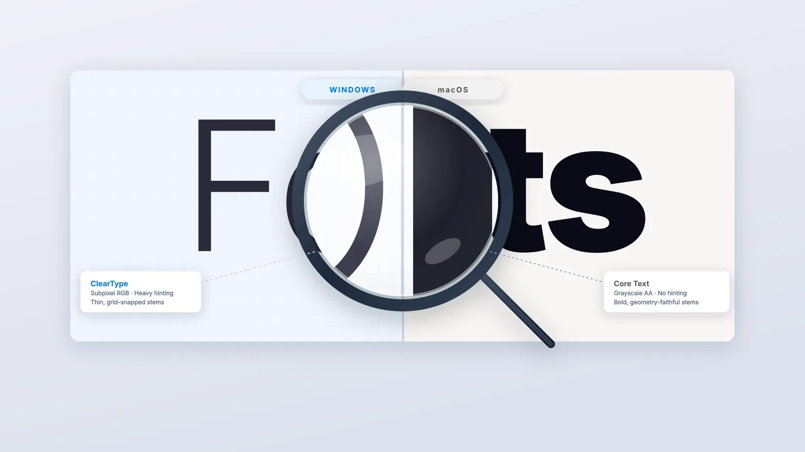

## The problem nobody warns you about

When I made the jump from Windows to KDE CachyOS, I expected the usual adjustment
period: learning new shortcuts, finding equivalent apps, tweaking the desktop. What
I didn't expect was to spend hours staring at my screen wondering why the text
looked so wrong.

Not broken, just *off*. Fuzzy at small sizes. Thin in places that felt wrong. Weirdly
light on a dark background. On a 1080p IPS monitor like the BenQ GW2480, it was
impossible to ignore. Windows fonts had always felt sharp and weighted just right.
Linux felt like reading through frosted glass.

> **Key Takeaways**
>
> - Linux and Windows use fundamentally different font rendering philosophies; neither is buggy, they just disagree on what "correct" means.
> - The Windows-style fix (subpixel rendering, aggressive hinting) gets you close to ClearType but can introduce colour fringing on some panels.
> - The macOS-style fix via **lucidglyph** uses stem-darkening to add weight without distorting letterforms, and works best on 90–110 PPI displays.
> - KDE Plasma can silently override your Fontconfig settings — you must set sub-pixel rendering to "None" in System Settings.
> - Chromium-based browsers have dropped FreeType entirely, so stem-darkening only works in Firefox.

This is one of the longest-standing complaints in the Linux desktop world. If
you've just migrated from Windows on a non-HiDPI 1080p display, there's a good
chance you're experiencing the same thing. Here is everything I tried, what I
learned, and what actually fixed it.

## Why do Linux fonts look different from Windows?

The root cause isn't a bug. It's a deliberate difference in philosophy and technology.

Windows uses a rendering pipeline built around **ClearType**, which relies on aggressive
hinting and subpixel rendering tuned specifically for LCD screens at typical desktop
pixel densities. The result is fonts that look crisp, heavy, and punchy, especially
on a 24-inch 1080p monitor like the BenQ GW2480 (which sits at roughly 91 PPI —
firmly in "low pixel density" territory by modern standards).

Linux uses **FreeType** for font rasterization and **Fontconfig** for font selection
and rendering rules. Out of the box, most distributions configure these conservatively
with grayscale anti-aliasing and slight hinting, leaving fonts looking lighter and
softer than their Windows equivalents at body text sizes (10–14px). On a low-PPI
display, this becomes obvious fast.

There are essentially two schools of thought on how to fix this, and I tried both.



## The two major approaches

After working through the ArchWiki's font configuration page and every forum thread
I could find, the fixes I encountered fell cleanly into two camps.

### Approach 1: make it look like Windows (ClearType-style)

This involves enabling **subpixel (RGB) rendering** and increasing hinting aggressiveness
to replicate Windows' ClearType behaviour. The key changes are:

- Setting `rgba` to `rgb` in Fontconfig
- Enabling the `lcddefault` LCD filter
- Setting `hintstyle` to `hintfull` or `hintmedium`
- Optionally switching the FreeType TrueType interpreter to version 35 (the classic
  "Windows 98" mode) via `FREETYPE_PROPERTIES="truetype:interpreter-version=35"`
  in `/etc/profile.d/freetype2.sh`

This makes text sharper and heavier. For many people on RGB LCD monitors, it's a
perfectly valid solution. On my BenQ GW2480, however, it introduced an annoying
colour fringing on some fonts, and the heavier hinting distorted certain typefaces
in ways I found more distracting than the original blur. A trade-off.

### Approach 2: make it look like macOS (stem-darkening)

macOS takes a different approach to the same low-PPI problem. Rather than forcing
pixels to align to a grid through aggressive hinting, it **darkens the stems** (the
strokes that make up each letterform) to make them appear heavier and more legible
without distorting the font's underlying geometry. The result: fonts that look
closer to their designed forms, just slightly bolder and more readable.

This is the approach that worked best on my BenQ GW2480, and it is the approach
taken by the **lucidglyph** project.

## Discovering lucidglyph

The project is maintained by **maximilionus** on GitHub:
[github.com/maximilionus/lucidglyph](https://github.com/maximilionus/lucidglyph).
Previously known as *freetype-envision*, it is a carefully curated collection of
FreeType and Fontconfig tweaks that together replicate the macOS-style stem-darkening
approach on Linux.

What lucidglyph does, concretely:

- Enables **FreeType stem-darkening** for the autofitter and CFF drivers, making
  medium and small-sized fonts visibly heavier and more readable without pixel-grid
  distortion. This is the core improvement.
- Enforces **grayscale anti-aliasing** (disabling subpixel), which is required for
  stem-darkening to look correct
- Applies **"Slight" hinting** as a suggestion (without overriding user preference)
- Adds **additional emboldening** at very small glyph sizes via Fontconfig
- Handles icon fonts intelligently, switching off emboldening for symbol typefaces
  to prevent "over-darkening"
- Leaves your system fonts and files completely untouched. It only modifies rendering
  behaviour.

Critically for 1080p monitors: the project description specifically flags low pixel
density (low-PPI) displays as the primary beneficiary of stem-darkening. The BenQ
GW2480 at 91 PPI is exactly the kind of screen this was designed for.

## Installation

Download the latest release from the
[releases page](https://github.com/maximilionus/lucidglyph/releases) on GitHub
(look under Assets → Source code), unpack it, and run:

```bash
sudo ./lucidglyph.sh install
```

Then reboot. That is it.

If you prefer a per-user install without touching system files, use the `--user` flag:

```bash
./lucidglyph.sh --user install
```

## KDE Plasma specific step — do not skip this

Here's something that caught me out. KDE Plasma, in some configurations, overrides
Fontconfig's anti-aliasing settings, particularly when fractional scaling is involved.
This is an acknowledged regression tracked in the KDE bug tracker, and it means
lucidglyph's grayscale anti-aliasing can get quietly overwritten.

The fix:

1. Open **System Settings**
2. Go to **Appearance & Style → Text & Fonts**
3. Make sure **Sub-pixel rendering** is set to **None**

Without this step, you might install lucidglyph, reboot, and see no improvement —
because Plasma is still forcing subpixel (RGBA) rendering behind the scenes.

## The Chromium problem (and why it matters)

One important caveat. As of early 2025, Chromium (and any browser or app built on
it, including Brave, Edge, and Electron-based apps) has moved to a new font rendering
system called **Fontations/Skrifa**, replacing FreeType entirely. Skrifa currently
has no stem-darkening support, so lucidglyph's core improvement won't apply inside
Chromium-based applications.

As of Chromium 139, the flag that previously allowed switching back to FreeType has
been permanently removed. The Fontations contributors have stated they no longer
intend to maintain FreeType support.

The practical workaround: use **Firefox** as your primary browser. Firefox still
uses FreeType and shows the full benefit of lucidglyph's improvements. The
difference in text rendering between Firefox and a Chromium browser with lucidglyph
installed is stark.

## Font recommendations

lucidglyph's author suggests some fonts that work well with stem-darkening and some
that don't. From the project's own notes:

Good choices with lucidglyph:

- **Sans-serif:** Inter, Adwaita Sans, Noto Sans
- **Serif:** Noto Serif
- **Monospace:** JetBrains Mono, MesloLG, DejaVu Sans Mono

One font to avoid: **Cantarell**, which becomes poorly legible due to the way
stem-darkening interacts with its geometry at small sizes. If you're on GNOME or
using a GNOME-derived app, Cantarell is often the default. Worth swapping it for
Noto Sans.

## My final setup

After all of this, here is what I am running on my BenQ GW2480 under KDE CachyOS:

- **lucidglyph** installed system-wide
- Sub-pixel rendering set to **None** in KDE System Settings
- System font: **Inter** (14px for UI, 11px for toolbars)
- Monospace font: **JetBrains Mono**
- Browser: **Firefox**
- Hinting: **Slight** (lucidglyph's default suggestion, which I left in place)

The improvement over out-of-box CachyOS font rendering is immediately visible.
Body text at 12–14px, which was thin and grey before, now has real weight and reads
cleanly at a comfortable distance from a 24-inch display.

## Summary

If you've just moved from Windows to KDE Linux on a 1080p display and your fonts
look blurry or thin, you have two main paths:

The **Windows-style fix** (subpixel rendering, aggressive hinting) gets you closest
to what you remember from Windows, but can introduce colour fringing and geometric
distortion.

The **macOS-style fix** via **lucidglyph** uses stem-darkening to add weight without
distorting letterforms, producing a result that is arguably more faithful to the
fonts' intended appearance. On a BenQ GW2480 specifically, and on any other IPS
panel in the 90–110 PPI range, this approach produces noticeably better results.

Either way, don't forget to check your KDE sub-pixel rendering settings. They will
silently undo everything else you configure.

## Resources

- [lucidglyph by maximilionus](https://github.com/maximilionus/lucidglyph)
- [ArchWiki Font configuration](https://wiki.archlinux.org/title/Font_configuration)
