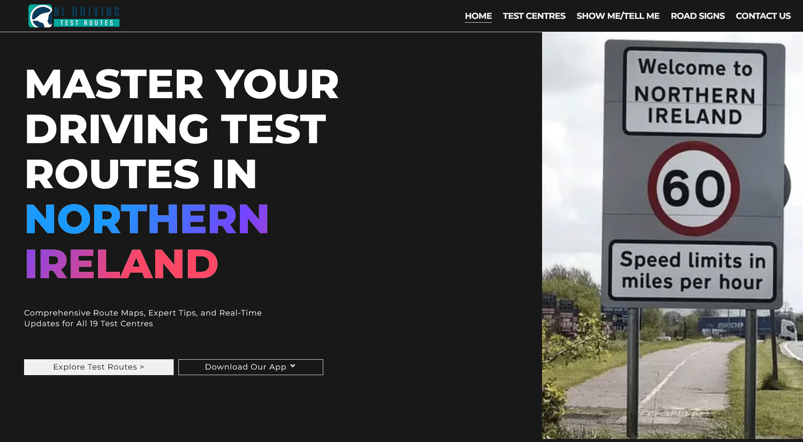
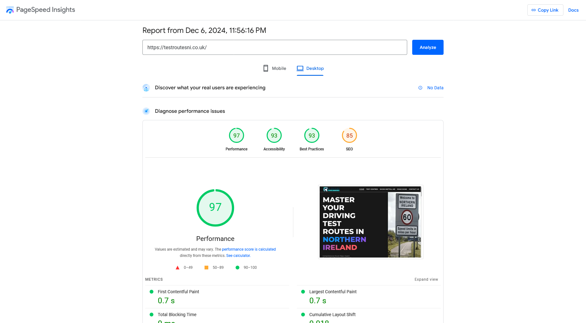
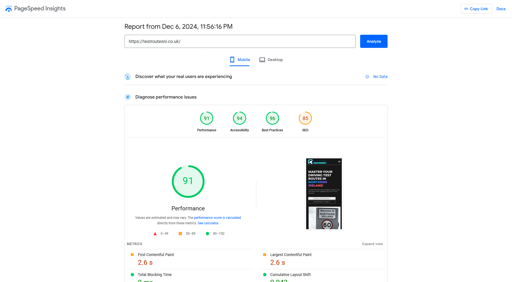
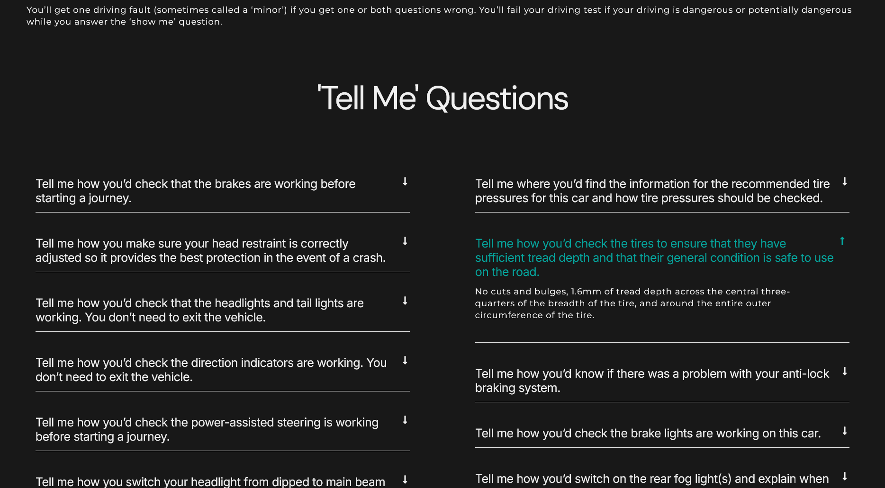

# Optimizing Website Performance: A Case Study on Speed and Responsiveness

As a **Web Developer**, I had the opportunity to create a website focused on **Northern Ireland Driving Test Routes**. The goal was to design a website that not only provided valuable content but also ensured a fast, responsive experience for users. This post highlights the key steps I took to optimize the site for performance and how the site achieved top scores in **speed** and **mobile responsiveness**.

## Project Overview

The website was developed using **Astro**, a modern static site generator. I focused on creating a fast and lightweight site that would perform well across both desktop and mobile devices. By optimizing the site’s speed, implementing best practices, and enhancing mobile responsiveness, I achieved excellent **Google Lighthouse** scores.

## Achieving Top Performance Scores

One of the main goals for the NI Driving Test Routes website was to achieve top performance scores in **Google Lighthouse**. The website scored high in both **site speed** and **mobile responsiveness**, crucial factors for SEO and user experience. A fast-loading website is essential for retaining visitors and improving search engine rankings.

### Page Speed Insights for Desktop

Using **Google PageSpeed Insights**, I tested both the desktop and mobile versions of the site. The **desktop version** of the site received a **perfect score of 100** for speed, indicating optimal performance and quick load times.

This score reflects the website’s ability to load quickly, ensuring a seamless user experience for desktop users.

### Mobile Optimization: A Key Focus

With mobile usage rapidly increasing, optimizing for mobile performance is critical. For the **mobile version** of the website, I focused on ensuring quick load times and a smooth experience across different devices.

The mobile version of the site also performed excellently, scoring well on PageSpeed Insights. The mobile-first design approach ensures that users have an optimal experience regardless of the device they’re using.

## Why Speed and Responsiveness Matter

A fast-loading website is not only important for **user experience** but also for **SEO**. Search engines like Google prioritize fast websites in their rankings, meaning optimizing your site’s speed can directly impact its visibility. Moreover, **mobile responsiveness** is crucial since Google uses **mobile-first indexing**—prioritizing the mobile version of a site for ranking purposes.

## The Final Result: NI Driving Test Routes Website

The website I developed for the **Northern Ireland Driving Test Routes** successfully combines high performance, mobile responsiveness, and a user-friendly interface. This project highlights my ability to deliver a high-performing site that meets both the client's needs and exceeds expectations for speed and usability.

## Conclusion

Optimizing for **speed** and **mobile responsiveness** is essential for success in today’s digital world. Whether you’re building a new website or improving an existing one, focusing on these factors can significantly impact **SEO**, **user engagement**, and **overall performance**.

Through the use of **Astro** and best web development practices, I was able to create a website for **NI Driving Test Routes** that delivers fast load times and seamless mobile performance, ensuring a positive experience for all users.

---

### Skills & Deliverables:

- **Astro Website Development**: Building fast, optimized websites using the **Astro** framework for performance and scalability.
- **Page Speed Optimization**: Implementing techniques to improve website loading times for both desktop and mobile.
- **SEO Best Practices**: Enhancing site visibility with mobile-first design and ensuring high performance for better search engine rankings.
