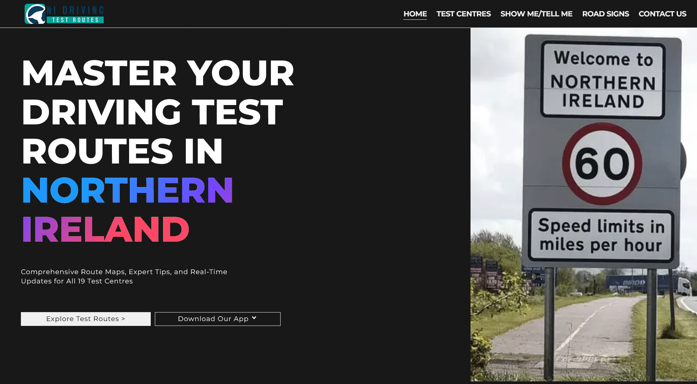
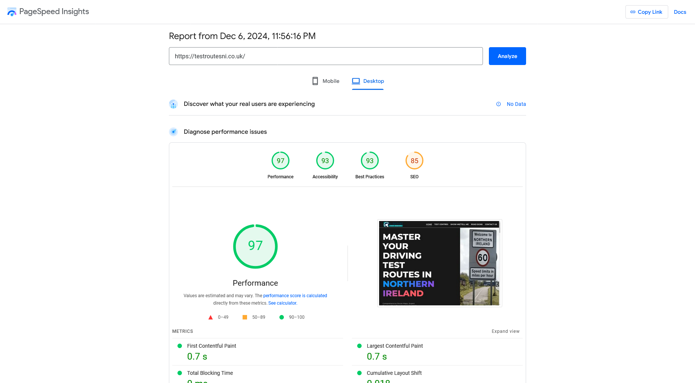
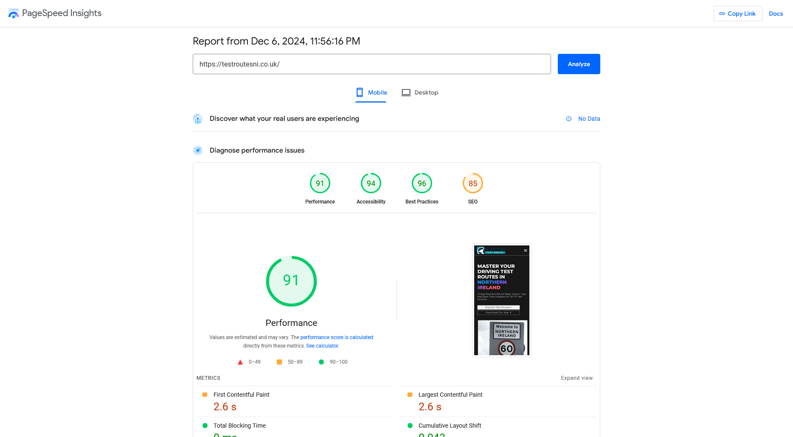
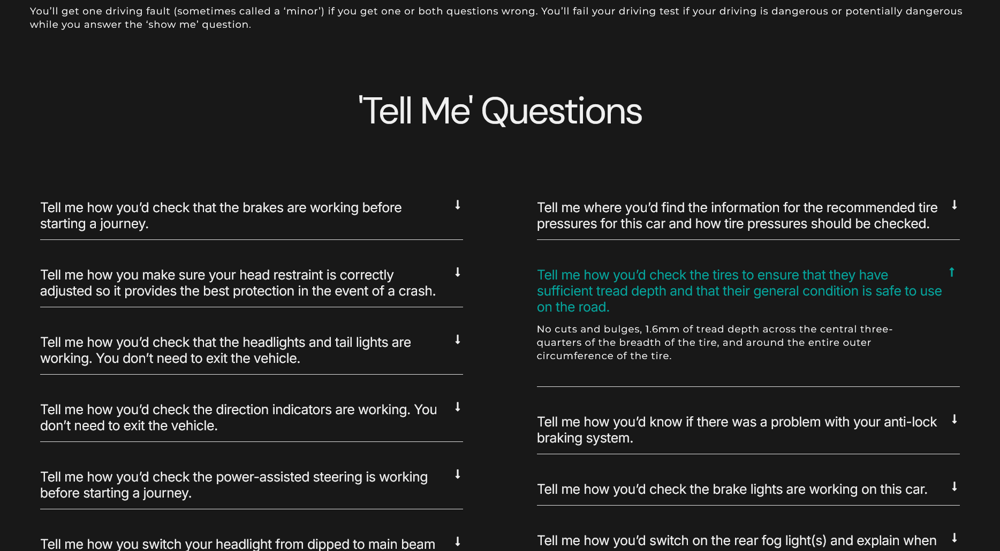

## A fast, content-first site built on Astro

I built a site about Northern Ireland driving test routes. The audience: people nervous about their test who want to know exactly where they'll be driving. They're searching on their phones while prepping, so every second of load time matters.

The brief was straightforward. Useful content. Fast pages. A clean mobile experience. I chose Astro, a static site generator that ships zero JavaScript by default. It proved to be the right call.

> The site delivers perfect Lighthouse scores on desktop. No JavaScript overhead. Content loads immediately. And since most visitors arrive on mobile, mobile performance got the most attention. That's where Google's eyes are too.

## Why Astro instead of WordPress?

A static generator makes sense for this kind of content site. Astro ships no JavaScript by default, so the browser gets HTML and CSS it can render right away. No database queries. No plugin overhead to maintain. That simplicity shows up directly in the speed scores, and it makes the site cheap to host and hard to break.

## How the site performed

I tested the output with Google PageSpeed Insights. Desktop scored a perfect 100.

Mobile scored well too. That matters because most people checking routes are on a phone, often while they're out. I kept the layout simple and the payload small.

Fast pages do two things. They keep visitors around. And they rank better because Google judges your site by the mobile version first. If that's slow, your rankings sink regardless of how good desktop looks.

The site does what it was built to do. Useful content loads quickly. It reads well on any screen. And it ranks.

