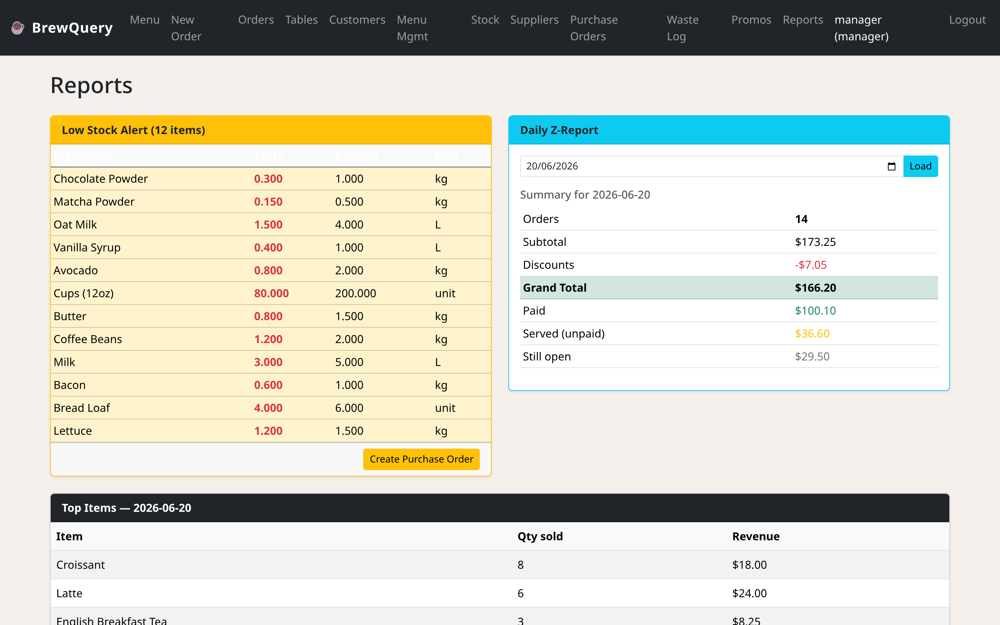
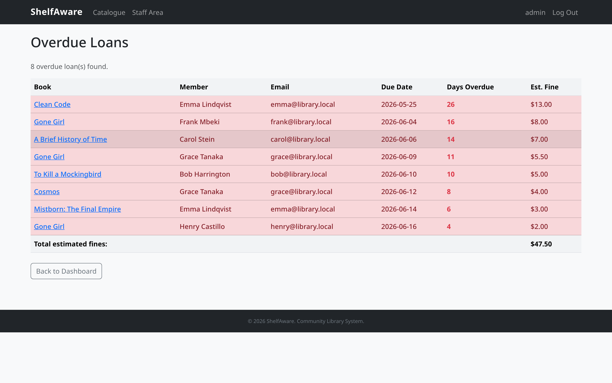
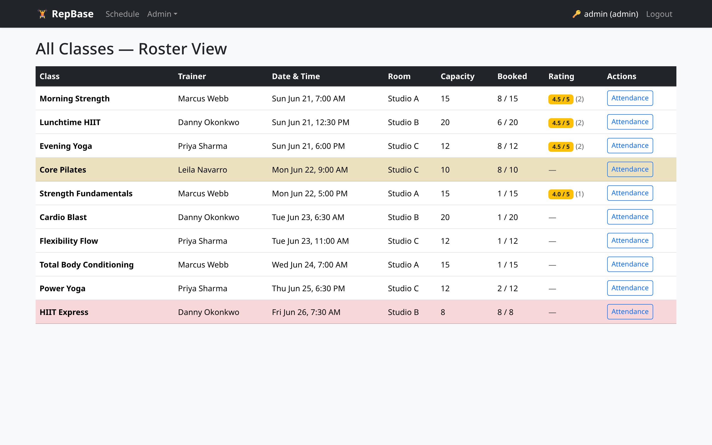

## Why no framework?

It's tempting to reach for Laravel and let an ORM hide the database. I deliberately didn't.
These three systems, a café back-office, a library, and a gym, are built in plain PHP 8.2
and MySQL, no framework and no ORM, precisely so the database work couldn't be hidden. Each one
runs on the built-in PHP server against hand-written SQL. And in all three, the part that
actually taught me something was the same: multi-step writes that have to be all-or-nothing.

> **Key Takeaways**
>
> - Three management systems built in plain PHP 8.2 and MySQL, no framework and no ORM, so the database work stays in the open.
> - The recurring lesson across all three was the transaction: multi-table writes that must either all land or all roll back.
> - Derived numbers like stock, seats, and fines are computed from the source rows, never cached as a counter that can drift.

## BrewQuery

[BrewQuery](https://github.com/lubdhak7414/BrewQuery) takes orders, tracks ingredient stock, and
raises purchase orders when things run low. The menu links to ingredients through a recipe table,
so submitting an order deducts stock across several ingredients in one transaction, and
receiving a supplier PO bumps it all back up the same way. Get the transaction boundary wrong and
you sell a coffee whose milk was never debited.

There are two roles with genuinely different surfaces: a cashier who builds orders, marks
them served/paid, and checks loyalty points; and a manager who owns menu CRUD, stock,
suppliers, purchase orders, and reports.



## ShelfAware

[ShelfAware](https://github.com/lubdhak7414/ShelfAware) handles members, a catalogue, loans, a
holds queue, overdue fines, and reviews. The return flow is the most interesting piece. It checks
whether a book is overdue, computes the fine (daily rate × days late), inserts the fine row,
and updates copy counts, all inside a single transaction. The holds queue auto-advances the
moment a copy comes back. Four coordinated writes that must either all land or all roll back.



## RepBase

[RepBase](https://github.com/lubdhak7414/RepBase) manages members, class bookings, waitlists,
attendance, and payments across member/trainer/admin roles. The booking flow is the transaction-
heavy one: booking a full class drops you onto the waitlist, and cancelling a spot
auto-promotes the next person in line. The "seats left" figure is a `LEFT JOIN` aggregate
against active bookings, not a counter you can let drift:

```sql
SELECT c.Title, c.Capacity - COUNT(b.Booking_id) AS seats_left
FROM class c
LEFT JOIN booking b ON b.Class_id = c.Class_id AND b.Status = 'booked'
GROUP BY c.Class_id;
```



## Takeaways

Building these without a framework forced me to handle the things an ORM normally papers over:
where a transaction begins and commits, what happens to a concurrent booking when capacity is
already full, and how to keep derived numbers (stock, seats, fines) honest by deriving them from
the source rows instead of caching a count that can drift. Each ships with a Docker Compose
setup that seeds the database on first boot, so any of them is one command away from running.

---

### Skills & Deliverables:

- **Relational data modelling**: recipe/ingredient links, holds queues, and capacity-bounded
  bookings expressed directly in schema.
- **SQL transactions & integrity**: multi-table all-or-nothing writes, derived aggregates over
  cached counters, and concurrency-aware booking logic.
- **Plain PHP + PDO**: role-based access, the built-in PHP server for local dev, and Docker
  Compose with automatic seeding.
