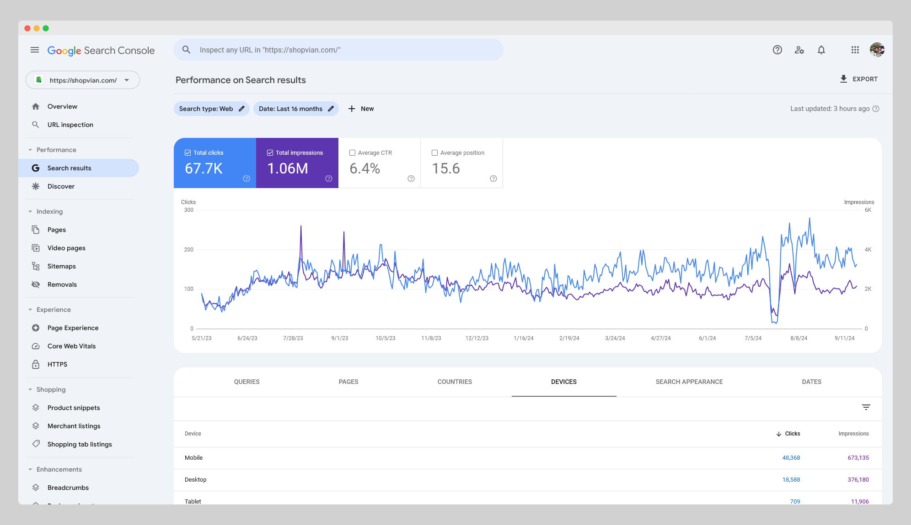

# How I Achieved Exceptional SEO Performance

As an **SEO Specialist & Website Developer**, one of my key goals was to boost organic traffic and improve website visibility. This post explores how I managed to significantly enhance my website's SEO performance, sharing key insights and strategies along the way. Below, I will provide a screenshot from Google Search Console showcasing the incredible growth in traffic that resulted from the optimizations I made.

## What is SEO?

**SEO**, or **Search Engine Optimization**, is the process of optimizing a website to improve its ranking on search engine results pages (SERPs). It involves a series of techniques designed to make a website more visible and attractive to search engines like Google. This helps increase organic traffic, which is the traffic that comes to your website without paid advertisements.

In simple terms, SEO is about ensuring that search engines can easily find and understand your content, which leads to higher rankings and better visibility. A well-executed SEO strategy can make all the difference in how much organic traffic your website receives.

by freepik

## How SEO Works

SEO works by focusing on several key elements to improve a website's ranking on search engines:

1. **On-Page SEO**: This refers to optimizing individual pages on a website, such as titles, headers, content, and images. Properly structured content with the right keywords will improve how search engines understand and rank your website.

2. **Off-Page SEO**: This involves building authority for your website by getting backlinks from reputable sources. Backlinks act as "votes of confidence" for your website, signaling to search engines that your content is valuable and trustworthy.

3. **Technical SEO**: This ensures that a website is set up in a way that search engines can crawl and index it efficiently. This includes optimizing website speed, mobile-friendliness, and ensuring that the website structure is clear and logical.

By combining these techniques, SEO helps search engines understand your content and rank it higher, ultimately driving more organic traffic.

## Basic SEO Rules to Follow

To get the most out of your SEO efforts, it’s essential to follow some key rules:

### 1. Keyword Research

Keywords are the foundation of SEO. By targeting the right keywords—those that potential visitors are searching for—you can increase the chances of your content ranking highly. Use tools like Google Keyword Planner or SEMrush to identify the best keywords for your content.

### 2. Quality Content

Content is king. Search engines prioritize high-quality, relevant content. Ensure your website provides value by answering questions, solving problems, and providing informative resources that users are searching for.

### 3. Optimize Titles and Meta Descriptions

Your title tags and meta descriptions play a significant role in SEO. Make sure each page on your website has a unique title tag that includes relevant keywords, and a meta description that entices users to click through.

### 4. Improve Page Speed

Page speed is a critical factor for both user experience and SEO. Slow websites can negatively impact rankings. Use tools like Google PageSpeed Insights to analyze and improve your website's speed.

### 5. Mobile Optimization

In today's world, mobile traffic is more important than ever. Ensure that your website is fully optimized for mobile devices, providing a seamless experience across all screen sizes.

## My SEO Success Story

In one of my recent projects, I built a website from scratch and implemented effective SEO strategies. After optimizing the site, I saw a substantial increase in organic traffic. Attached below is a screenshot from **Google Search Console**, showing the impressive traffic growth achieved post-optimization.

This project demonstrates my ability to leverage SEO best practices, from keyword optimization to on-page SEO and technical improvements. By focusing on content strategy, improving website speed, and ensuring mobile optimization, I was able to achieve remarkable results and drive significant traffic to the website.

## Conclusion

SEO is an essential part of any website's success. By implementing the right strategies, focusing on quality content, and adhering to SEO best practices, you can improve your website’s visibility, drive organic traffic, and ultimately achieve your business goals.

I hope this case study provides valuable insights into how SEO works and the steps I took to enhance my website's performance. If you have any questions about SEO or want to learn more, feel free to reach out!

---

### Skills & Deliverables:

- **Web Content Strategy**: Developing content strategies that resonate with target audiences.
- **SEO Performance**: Achieving measurable SEO results through targeted optimizations.
- **WordPress Development**: Building user-friendly websites optimized for SEO.
- **Ecommerce Website Development**: Crafting SEO-optimized ecommerce sites that drive conversions.

By combining SEO best practices with solid website development, I have helped numerous businesses achieve long-term success.
